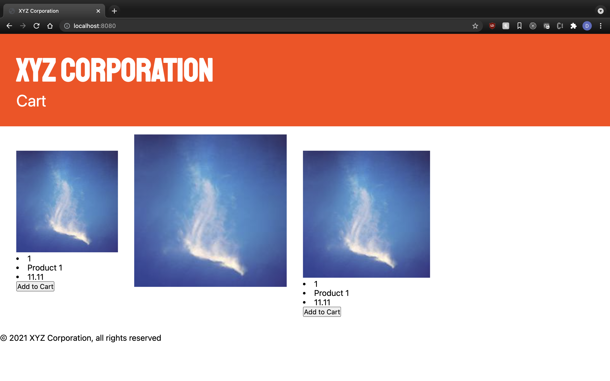

# xyz.com exercise

CSS Exercise B

- without touching the html, use specificity to change the styles of the items below

1. image in to the left needs to be 200px x 200px

2. image in the middle needs to be 300px x 300px

3. image in to the right needs to be 250px x 250px

## finished product should look roughly like this - image will be diffferent but that's ok

